# System Architecture

## Overview

Smiling Critters is a **Streamlit single-page application** structured as a multi-page app via manual session-state routing. All state is held in `st.session_state` per browser session; persistent data (chat logs, flags, settings) lives in a local **SQLite** file.

```mermaid
graph TD
    Browser(["🌐 Browser\nStreamlit"])
    app["app.py\nentry point · router · sidebar"]

    home["pages/home.py\ncritter selection"]
    chat["pages/chat.py\nmain chat interface"]
    journal["pages/journal.py\nkeepsake journal"]
    emotion["pages/emotion_wheel.py\nfeelings picker"]
    parent["pages/parent_dashboard.py\nparent control panel"]

    personas["critters/personas.py\ncharacter definitions"]
    router["critters/router.py\nLLM calls"]
    filters["safety/filters.py\ncontent filter"]
    db["db/queries.py\nSQLite CRUD"]
    theme["theme.py\nglobal CSS · SVG critters"]

    Browser --> app
    app -->|"page = 'home'"| home
    app -->|"page = 'chat'"| chat
    app -->|"page = 'journal'"| journal
    app -->|"page = 'parent'"| parent

    chat --> emotion
    chat --> personas
    chat --> router
    chat --> filters
    chat --> db

    home --> personas
    home --> theme
    chat --> theme
```

---

## Module Responsibilities

### `app.py`
- Sets page config (must be first Streamlit call)
- Loads `.env` via `python-dotenv`
- Initialises the SQLite database (`init_db()`)
- Manages `st.session_state` defaults
- Renders the sidebar (Home, Journal, Parent Dashboard links)
- Routes to the correct `pages/` module based on `st.session_state.page`

### `pages/home.py`
- Renders the critter selection screen
- Displays animated SVG critter cards via `streamlit.components.v1.html()` (iframe, avoids Streamlit's HTML sanitiser)
- Renders per-critter colour-themed `st.button()` rows below the cards
- Navigation: sets `current_critter`, clears chat state, goes to `"chat"`

### `pages/chat.py`
- Initialises or resumes a chat session
- Renders: header bar (back, avatar, name, LLM status badge), session progress bar, wellness reminder, optional emotion wheel (Luna only), scrollable chat history, input row
- Calls `safety/filters.py` on **every user message** (Layer 2) and on **every LLM response** (Layer 3)
- Streams LLM tokens via `critters/router.py`
- Saves all messages and flags to SQLite
- On "Bye!", ends the session and writes a journal entry to `st.session_state`

### `pages/journal.py`
- Reads journal entries from `st.session_state.journal_entries` (in-memory, current Python session only — not persisted across restarts)
- Renders styled keepsake cards per critter colour

### `pages/emotion_wheel.py`
- Standalone component, rendered inside `pages/chat.py` for Luna only
- Shows 24 emotions across 4 groups (Happy / Sad / Angry / Scared)
- Returns the selected emotion label string, which the chat page injects as a user message

### `pages/parent_dashboard.py`
- PIN-gated (stored in SQLite settings, default `1234`)
- Four tabs: Overview, Chat Logs, Safety Alerts, Settings
- Reads full chat history, safety flags, and usage stats from SQLite
- Allows live configuration of Ollama URL, model, Gemini key, child name, time limits, PIN

### `critters/personas.py`
- Defines the `CRITTERS` dict — all character metadata and system prompts
- Exposes `get_critter(id)` and `get_all_critters()`
- System prompts are the **primary (Layer 1) safety control** — each prompt contains strict behavioural rules baked into the character voice

### `critters/router.py`
- `get_llm_response()` — the single call site for all AI inference
- Reads live config from the DB (falls back to env vars)
- Sanitises messages (strips emails, phone numbers) before any external call
- Tries Ollama first; falls back to Gemini; yields a friendly error if both unavailable
- All calls are **streaming generators** — tokens are yielded and displayed incrementally

### `safety/filters.py`
- `check_input(text, critter_id)` — Layer 2, runs before LLM call
- `check_output(text)` — Layer 3, runs before displaying LLM response
- `wellness_reminder(minutes_elapsed, critter_id)` — time-based in-chat reminders
- Returns a `SafetyResult` dataclass with level, optional redirect message, and optional parent note

### `db/queries.py`
- All SQLite access in one place; no ORM
- `init_db()` creates tables and seeds default settings on first run
- Functions: sessions CRUD, messages CRUD, safety flags CRUD, settings get/set, usage analytics

### `theme.py`
- `CRITTER_SVGS` — hand-crafted inline SVG for each critter
- `GLOBAL_CSS` — imported Google Fonts (Nunito), button styles, animations, sidebar gradient, chat bubbles
- `apply_theme()` — helper to inject CSS; called from `app.py`

---

## Data Flow — Normal Chat Message

```mermaid
flowchart TD
    A(["👧 User types message"])
    B["check_input\nsafety/filters.py — Layer 2"]

    CRISIS["🚨 Show crisis response\n+ save flag\n⚡ Skip LLM"]
    REDIRECT["↩️ Show redirect message\n+ save flag\n⚡ Skip LLM"]
    ALERT["⚠️ Save flag silently\ncontinue to LLM"]

    SAVE_IN["save_message\ndb/queries.py — user msg"]
    LLM["get_llm_response\ncritters/router.py — streaming"]

    OLLAMA["🏠 Ollama /api/chat\nlocal · private"]
    GEMINI["☁️ Gemini streamGenerateContent\ncloud fallback"]

    CHK_OUT["check_output\nsafety/filters.py — Layer 3"]
    BLOCKED["🔴 Replace with safe fallback\n+ save flag"]
    DISPLAY["✅ Display streamed response"]
    SAVE_OUT["save_message\ndb/queries.py — assistant msg"]

    A --> B
    B -->|CRISIS| CRISIS
    B -->|REDIRECT| REDIRECT
    B -->|ALERT| ALERT
    B -->|SAFE| SAVE_IN
    ALERT --> SAVE_IN
    SAVE_IN --> LLM

    LLM -->|Ollama available| OLLAMA
    LLM -->|Ollama unavailable| GEMINI

    OLLAMA --> CHK_OUT
    GEMINI --> CHK_OUT

    CHK_OUT -->|BLOCKED| BLOCKED
    CHK_OUT -->|OK| DISPLAY
    BLOCKED --> SAVE_OUT
    DISPLAY --> SAVE_OUT
```

---

## Session State Keys

| Key | Type | Purpose |
|-----|------|---------|
| `page` | str | Current page: `"home"`, `"chat"`, `"journal"`, `"parent"` |
| `current_critter` | str | Critter ID: `"pip"`, `"luna"`, `"finn"`, `"shelby"`, `"stella"` |
| `chat_messages` | list[dict] | In-memory message history for current session (`{"role", "content"}`) |
| `session_id` | int | SQLite sessions.id for the current chat |
| `session_start` | float | `time.time()` snapshot at session start (for elapsed time) |
| `wellness_shown` | set[int] | Set of thresholds (30, 60) already shown this session |
| `show_emotion_wheel` | bool | Luna: whether the emotion wheel UI is visible |
| `selected_emotion` | str\|None | Luna: currently highlighted emotion label |
| `parent_authenticated` | bool | Whether the PIN gate has been passed |
| `journal_entries` | list[dict] | In-memory journal cards (current Python session only) |

---

## Technology Stack

| Layer | Technology |
|-------|-----------|
| Frontend / Server | [Streamlit](https://streamlit.io) ≥ 1.32 |
| Language | Python 3.11+ |
| Local AI | [Ollama](https://ollama.ai) — `llama3:latest` default |
| Cloud AI | Google Gemini 1.5 Flash (streaming SSE) |
| Database | SQLite (stdlib `sqlite3`) |
| Config | `python-dotenv` + `.env` file |
| HTTP | `requests` |
| Fonts | Google Fonts — Nunito, Nunito Sans (CDN) |
