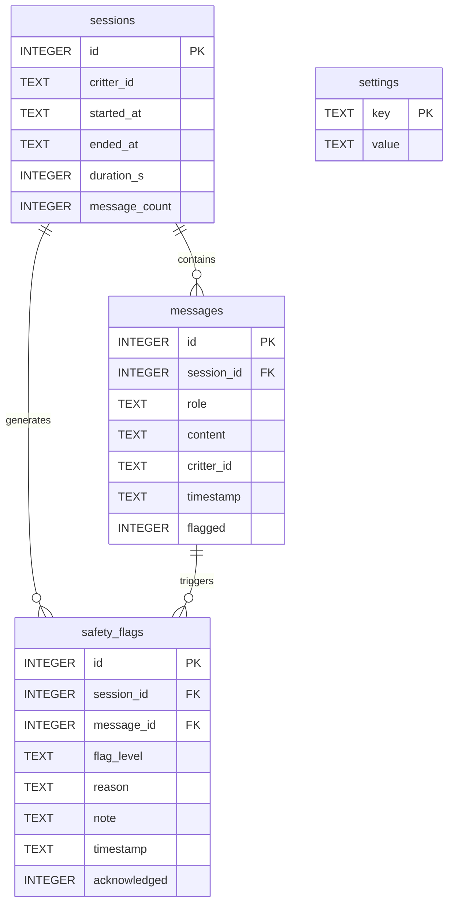
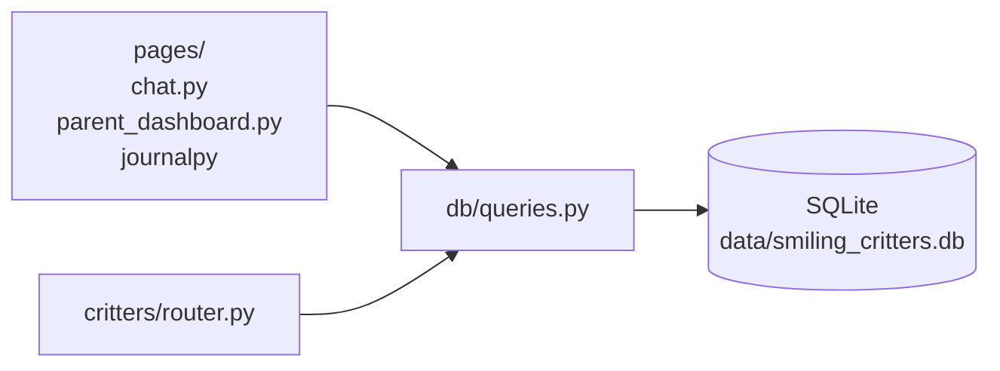
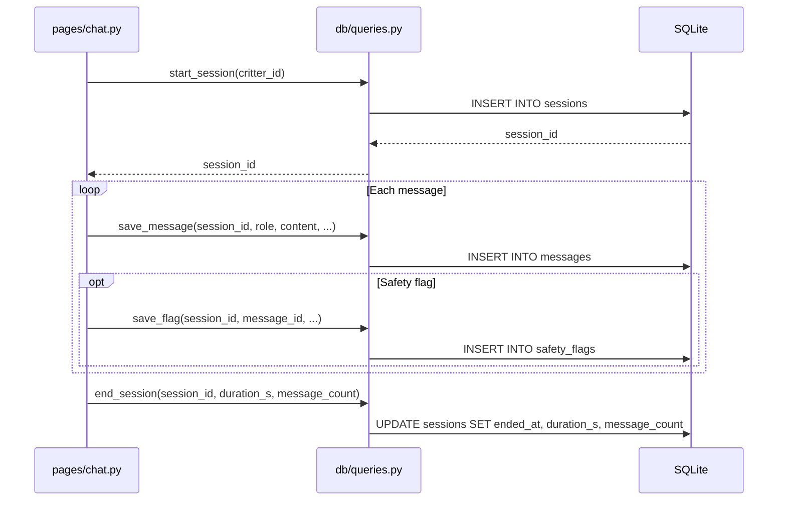

# Data Model

## Overview

All persistent data lives in a single **SQLite** file at `data/smiling_critters.db` (path configurable via `DB_PATH` env var). There is no ORM — all queries are plain `sqlite3` with `row_factory = sqlite3.Row` for dict-like access.

The `data/` directory is in `.gitignore` — chat logs, safety flags, and API keys are never committed.

---

## Entity Relationship

---

## Table Reference

### `sessions`

One row per chat session (critter pick → "Bye!" or navigation away).

| Column | Type | Notes |
|--------|------|-------|
| `id` | INTEGER PK | Auto-increment |
| `critter_id` | TEXT | `"pip"`, `"luna"`, `"finn"`, `"shelby"`, `"stella"` |
| `started_at` | TEXT | ISO 8601 datetime |
| `ended_at` | TEXT | ISO 8601 datetime; NULL if session never ended cleanly |
| `duration_s` | INTEGER | Elapsed seconds; set on `end_session()` |
| `message_count` | INTEGER | Count of user (not assistant) messages; set on `end_session()` |

### `messages`

One row per message (both user and assistant turns).

| Column | Type | Notes |
|--------|------|-------|
| `id` | INTEGER PK | Auto-increment |
| `session_id` | INTEGER FK | → `sessions.id` |
| `role` | TEXT | `"user"` or `"assistant"` |
| `content` | TEXT | Full message text |
| `critter_id` | TEXT | Redundant with session but fast for per-critter queries |
| `timestamp` | TEXT | ISO 8601 datetime |
| `flagged` | INTEGER | `0` = safe, `1` = redirect, `2` = alert, `3` = crisis |

### `safety_flags`

One row per safety event. Created for ALERT and CRISIS inputs, and for any Layer 3 output filter hit.

| Column | Type | Notes |
|--------|------|-------|
| `id` | INTEGER PK | Auto-increment |
| `session_id` | INTEGER FK | → `sessions.id` |
| `message_id` | INTEGER FK | → `messages.id` (the triggering message) |
| `flag_level` | TEXT | `"redirect"`, `"alert"`, `"crisis"` |
| `reason` | TEXT | Short machine-readable description |
| `note` | TEXT | Human-readable note for parent (truncated message excerpt) |
| `timestamp` | TEXT | ISO 8601 datetime |
| `acknowledged` | INTEGER | `0` = unread, `1` = parent reviewed |

### `settings`

Simple key/value store for all app configuration.

| Key | Default | Description |
|-----|---------|-------------|
| `parent_pin` | `"1234"` | Dashboard PIN — change immediately |
| `child_name` | `"Friend"` | Used in critter greeting messages |
| `daily_limit_min` | `"45"` | Session time limit shown as progress bar |
| `reminder_30` | `"1"` | Enable 30-min wellness reminder |
| `reminder_60` | `"1"` | Enable 60-min wellness reminder |
| `quiet_hours_start` | `"20:00"` | Reserved for future quiet-hours feature |
| `quiet_hours_end` | `"07:00"` | Reserved for future quiet-hours feature |
| `llm_prefer_local` | `"1"` | Prefer Ollama over Gemini |
| `ollama_url` | from `.env` | Ollama base URL; synced from env on first run |
| `ollama_model` | from `.env` | Model name, e.g. `llama3:latest` |
| `gemini_key` | from `.env` | Gemini API key; synced from env if DB key is blank |

All values are stored as TEXT. The DB is the **source of truth at runtime** — env vars only seed the DB on first run or when the DB key is empty.

---

## Initialisation

`init_db()` in `db/queries.py` runs on every app startup:

1. Creates all four tables with `CREATE TABLE IF NOT EXISTS`
2. Seeds user-configurable defaults with `INSERT OR IGNORE` (preserves any parent changes)
3. Syncs AI config keys from env vars using `INSERT OR IGNORE` (won't overwrite dashboard changes)
4. Special case: if `.env` has a real Gemini key but the DB key is blank/placeholder, updates the DB

---

## Query Layer

All DB access goes through functions in `db/queries.py`. No raw SQL appears in any page or critter module.

### Session lifecycle

---

## Analytics Queries

`get_usage_stats()` returns a summary dict used in the parent dashboard Overview tab:

- `total_sessions` — `COUNT(*) FROM sessions`
- `total_messages` — `COUNT(*) FROM messages WHERE role='user'`
- `total_flags` — `COUNT(*) FROM safety_flags`
- `unread_flags` — `COUNT(*) FROM safety_flags WHERE acknowledged=0`
- `critter_usage` — `GROUP BY critter_id ORDER BY n DESC` on sessions
- `avg_session_min` — `AVG(duration_s)` on completed sessions ÷ 60

---

## Data Retention Notes

- No automatic pruning — all history kept indefinitely in the local file
- `data/` is gitignored; the DB file is never synced to version control
- For Phase 2 (iOS), the same schema will be ported to SwiftData with an identical field layout
