# LLM Routing

## Design Goals

1. **Privacy-first** — local AI (Ollama) is always tried first; no data leaves the device unless Ollama is unavailable
2. **Zero downtime** — automatic fallback to Gemini when Ollama is offline
3. **Streaming** — all responses stream token-by-token for a responsive feel
4. **Child-safe** — PII stripped before any cloud call; responses pass through Layer 3 safety filter
5. **Live config** — URL, model, and API keys are read from the DB on every call; no restart needed after dashboard changes

---

## Routing Decision

```mermaid
flowchart TD
    START(["get_llm_response() called"])
    CFG["Read config\nDB → env fallback"]
    PREF{"use_local = True\n& Ollama reachable?"}
    OLLAMA["🏠 _call_ollama()\nOllama /api/chat"]
    OOK{"Tokens yielded\nsuccessfully?"}
    GKEY{"Gemini API\nkey configured?"}
    GEMINI["☁️ _call_gemini()\nGemini 1.5 Flash SSE"]
    GOK{"Tokens yielded\nsuccessfully?"}
    GERR["Yield error token\n(Gemini exception)"]
    NONE["Yield friendly\n'no AI' message"]
    DONE(["Caller receives\nstreaming tokens"])

    START --> CFG --> PREF
    PREF -->|Yes| OLLAMA --> OOK
    OOK -->|Yes| DONE
    OOK -->|No / exception| GKEY
    PREF -->|No| GKEY
    GKEY -->|Yes| GEMINI --> GOK
    GOK -->|Yes| DONE
    GOK -->|No / exception| GERR --> DONE
    GKEY -->|No| NONE --> DONE
```



---

## Configuration

Config is read from `db/queries.get_setting()` on every call, falling back to env vars if the DB key is missing. This means a parent can change the Ollama URL or swap Gemini keys in the dashboard and the next message immediately uses the new config — no app restart.

| Setting key | Env fallback | Description |
|-------------|-------------|-------------|
| `ollama_url` | `OLLAMA_BASE_URL` | Base URL for Ollama, e.g. `http://localhost:11434` |
| `ollama_model` | `OLLAMA_MODEL` | Model name, e.g. `llama3:latest` |
| `gemini_key` | `GEMINI_API_KEY` | Google Gemini API key |
| `llm_prefer_local` | `"1"` | `"1"` to try Ollama first, `"0"` to go straight to Gemini |

---

## Ollama Integration

**Availability check:** `GET {url}/api/tags` with a 2-second timeout. Results are **cached for `OLLAMA_CACHE_TTL` seconds** (default: 5 s) so the pre-call check and the chat header status badge share a single network round-trip rather than each blocking independently.

The cache is a module-level dict `_ollama_cache = {"available", "checked_at", "url"}`. When the URL changes (e.g. parent updates settings), the cache key mismatches and a fresh check fires automatically.

**Inference call:** `POST {url}/api/chat` with `"stream": true`.

Payload structure:
```json
{
  "model": "llama3:latest",
  "stream": true,
  "messages": [
    {"role": "system", "content": "<critter system prompt>"},
    {"role": "user",   "content": "..."},
    {"role": "assistant", "content": "..."}
  ],
  "options": {
    "temperature": 0.7,
    "num_predict": 300
  }
}
```

Each streamed line is a JSON object; tokens are extracted from `data.message.content`. Generation stops when `data.done == true`.

**Typical latency:** First token in ~1–3 s on a modern Mac with `llama3:latest`.

---

## Gemini Integration

**Model:** `gemini-2.0-flash` — chosen for its low latency, generous free tier, and child-safe output quality.

**Endpoint:** `POST https://generativelanguage.googleapis.com/v1beta/models/gemini-1.5-flash:streamGenerateContent?alt=sse&key={api_key}`

The `?alt=sse` parameter enables Server-Sent Events streaming. Each `data:` line is parsed for `candidates[0].content.parts[*].text`.

Gemini uses a different role vocabulary (`"model"` instead of `"assistant"`), mapped before the call:

```python
role = "user" if m["role"] == "user" else "model"
```

The system prompt is passed via the `system_instruction` top-level field (not as a message), which Gemini 1.5+ supports natively.

**Cost note:** Gemini Flash is ~$0.075 per 1M input tokens. A normal child session (30 messages × ~150 tokens each) costs < $0.001.

---

## PII Sanitisation

Before any message list is sent to **Gemini (cloud only)**, `_sanitise_for_cloud()` strips:

- **Email addresses** — replaced with `[email removed]`
- **Phone numbers** (US format) — replaced with `[phone removed]`

This does **not** run for Ollama calls — traffic is local, so there is nothing to protect. Running sanitisation for every local message would be unnecessary overhead.

---

## Prompt Construction

Every call prepends the critter's `system_prompt` to the messages list. The full context sent to the model is:

```
[system]    <critter system prompt — includes persona + safety rules>
[user]      <first child message>
[assistant] <first critter response>
[user]      <second child message>
...
[user]      <latest child message>        ← current turn
```

`num_predict: 300` / `maxOutputTokens: 300` caps responses to keep them short and child-appropriate, matching the 2–4 sentence target in all system prompts.

## Mid-Stream Failure Handling

If Ollama starts streaming but drops the connection part-way through a response, the router **does not fall through to Gemini**. A partial Ollama response followed by a full Gemini response would be garbled and confusing for a child.

Instead:
- If `yielded == False` when the exception fires (no tokens received yet) → fall through to Gemini silently.
- If `yielded == True` (tokens already on screen) → append a small reconnect nudge and return:
  > *"Oops, my connection went a bit wobbly! Could you ask me that again? 🌟"*

---


`check_llm_status()` returns a status dict used in the chat header badge and parent dashboard:

```mermaid
flowchart LR
    CS["check_llm_status()"]
    O{"Ollama\nreachable?"}
    G{"Gemini key\nconfigured?"}

    CS --> O
    O -->|Yes| BADGE_O["🏠 Local"]
    O -->|No| G
    G -->|Yes| BADGE_G["☁️ Cloud"]
    G -->|No| BADGE_N["❌ Off"]
```



The badge updates on every page render, so it reflects the live state without any manual refresh.

---

## Debug Panel

When the active backend is `"none"`, the chat page automatically expands an Ollama troubleshooting panel showing:

- Current URL and model from config
- Connection status
- Fix instructions (start Ollama, `ollama pull <model>`)
- Gemini key status and setup link

The panel is available as a collapsed expander even when a backend is connected, for parent reference.
