# Safety System Design

## Overview

The safety system is a **three-layer defence-in-depth** model. Every child message and every AI response passes through at least one filter before anything is shown on screen. No single layer is relied upon alone.

```mermaid
flowchart LR
    CP["🧒 Child's message"] --> L2["Layer 2\nInput filter\nsafety/filters.py"]
    L2 --> LLM["🤖 LLM\ncritters/router.py"]
    LLM --> L3["Layer 3\nOutput filter\nsafety/filters.py"]
    L3 --> SC["💬 Screen"]

    L1["Layer 1\nSystem prompt\ncritters/personas.py"] -.->|"baked into\nevery call"| LLM
```

---

## Layer 1 — System Prompts

**Location:** `critters/personas.py` — each critter's `system_prompt` field  
**Trigger:** Every LLM call; the system prompt is prepended to every message list

This is the model's own self-regulation. Each system prompt includes explicit, in-character rules:

- Refuse violent, adult, and drug topics ("gently redirect, don't engage")
- Validate emotions before advice
- Keep language age-appropriate
- For distress signals, encourage finding a trusted adult
- For crisis signals, give warmth + clear adult-escalation instruction

**Limitation:** Layer 1 alone is insufficient — models can follow instructions imperfectly or be jailbroken by clever phrasing. Layers 2 and 3 exist precisely because Layer 1 is a probabilistic control.

---

## Layer 2 — Input Filter

**Location:** `safety/filters.py` → `check_input(text, critter_id)`  
**Trigger:** Called on every user message, **before** the LLM is contacted

### Detection levels

```mermaid
flowchart TD
    MSG["Child's message"] --> RE["Regex pattern match"]
    RE -->|"_crisis_re matches"| CRISIS
    RE -->|"_alert_re matches"| ALERT
    RE -->|"_redirect_re matches"| REDIRECT
    RE -->|"no match"| SAFE

    CRISIS["🚨 CRISIS\nLevel 3"]
    ALERT["⚠️ ALERT\nLevel 2"]
    REDIRECT["↩️ REDIRECT\nLevel 1"]
    SAFE["✅ SAFE\nLevel 0"]
```

### Pattern categories

| Level | Category | Example phrases matched |
|-------|----------|------------------------|
| **CRISIS** | Self-harm, suicidal ideation | `hurt myself`, `kill myself`, `want to die`, `no one would miss me` |
| **CRISIS** | Severe distress | `everyone would be better without me`, `self-harm` |
| **ALERT** | Bullying (as victim) | `bully`, `nobody likes me`, `excluded`, `left out`, `no friends` |
| **ALERT** | Personal info sharing | `my address`, `my school`, `my phone number`, `come find me` |
| **ALERT** | Physical harm by others | `hitting me`, `someone touched`, `abuse` |
| **REDIRECT** | Violence / weapons | `kill`, `gun`, `knife`, `weapon`, `bomb`, `blood` |
| **REDIRECT** | Adult content | `sex`, `porn`, `naked`, `xxx` |
| **REDIRECT** | Drugs / alcohol | `drug`, `weed`, `cocaine`, `drunk`, `vape` |
| **REDIRECT** | Scary media | `horror`, `demon`, `nightmare`, `ghost attack` |

All patterns are compiled as case-insensitive regex at module import time (`re.IGNORECASE`), so matching adds negligible latency.

### Outcomes by level

| Level | LLM called? | Response shown | Parent notified? |
|-------|-------------|---------------|-----------------|
| SAFE | ✅ Yes | LLM response (after Layer 3) | No |
| REDIRECT | ❌ No | Critter-specific redirect message | No |
| ALERT | ✅ Yes | LLM response | ✅ Silent flag saved to DB |
| CRISIS | ❌ No | Fixed crisis support message | ✅ Urgent flag saved to DB |

### Critter-specific redirect messages

Each critter has its own redirect phrasing that matches their character voice:

- **Pip:** steers back to learning (`"Tell me something you learned today!"`)
- **Luna:** steers back to feelings (`"What's going on in your heart?"`)
- **Finn:** offers a story alternative (`"What if a friendly dragon showed up?"`)
- **Shelby:** breathes and grounds (`"Let's take a slow breath together"`)
- **Stella:** offers a wonder fact (`"Did you know there are more stars than grains of sand?"`)

### Crisis response

A single, fixed response is shown for all crisis-level inputs — it is never generated by the LLM:

> *"I hear you, and I care about you so much 💜 … Please tell a grown-up you trust right now … You are loved. You matter."*

The response includes bolded urgency for the adult-escalation instruction and is identical regardless of which critter the child is chatting with.

---

## Layer 3 — Output Filter

**Location:** `safety/filters.py` → `check_output(text)`  
**Trigger:** Called on every complete LLM response, **before** it is displayed

Runs the same `_crisis_re` and `_redirect_re` patterns against the LLM's output. If either matches, the response is **replaced entirely** with a safe fallback:

- **Crisis in output:** `"I'm here with you 💜 Can you find a grown-up you trust to talk to right now?"`
- **Redirect in output:** `"Oops, my brain went a bit fuzzy! Let's talk about something fun instead ✨"`

A parent flag is saved in both cases. This layer exists because even a well-prompted model can occasionally produce unexpected content — belt-and-suspenders.

---

## Wellness Reminders

**Location:** `safety/filters.py` → `wellness_reminder(minutes_elapsed, critter_id)`  
**Trigger:** Checked on every chat render in `pages/chat.py` → `_check_wellness()`; fires at most once per threshold per session

| Threshold | Tone | Action |
|-----------|------|--------|
| **30 min** | Gentle suggestion | Encourages a 5-minute break; session continues |
| **60 min** | Strong encouragement | Encourages ending the session for the day |

Both thresholds are tracked in `st.session_state.wellness_shown` (a `set`) to prevent repeat display. Each critter delivers the reminder in their own voice.

The daily time limit (default 45 min) is configurable per-parent in the dashboard and shown as a progress bar in the chat header.

---

## Safety Flags — Data Structure

Every flag saved to SQLite (`safety_flags` table) contains:

| Field | Content |
|-------|---------|
| `flag_level` | `"redirect"`, `"alert"`, or `"crisis"` |
| `reason` | Short description of what triggered the flag |
| `note` | Human-readable note for the parent (e.g. truncated message) |
| `message_id` | FK to the triggering message row |
| `session_id` | FK to the session |
| `timestamp` | ISO datetime |
| `acknowledged` | `0` / `1` — parent has reviewed |

The parent dashboard shows:
- A banner with unread flag count on every page load
- 🚨 banners for any unacknowledged crisis flags
- Per-flag expanders with full context and "Mark as reviewed" action

---

## Threat Model

| Threat | Mitigation |
|--------|-----------|
| Child asks the LLM to "pretend" safety rules don't exist | Layer 1 (prompt) + Layer 2 (regex on input) + Layer 3 (regex on output) |
| LLM hallucinates harmful content unprompted | Layer 3 output filter catches and replaces |
| Child discloses abuse or bullying | ALERT/CRISIS flag → parent dashboard; critter validates and encourages adult |
| Child in suicidal ideation | CRISIS flag → immediate fixed support message + urgent parent flag |
| Child shares personal info (address, school) | ALERT flag → parent notified; LLM is called but parent sees the message |
| Excessive screen time | Wellness reminders at 30/60 min; daily limit progress bar |
