# UI / UX Design

## Design System

### Typography

| Font | Use | Source |
|------|-----|--------|
| **Nunito** (700, 800, 900) | Headings, critter names, buttons, labels | Google Fonts CDN |
| **Nunito Sans** (400, 600) | Body text, chat messages, descriptions | Google Fonts CDN |
| Segoe UI / Arial (system) | Fallback | System |

Nunito's rounded letterforms read as friendly and child-appropriate. The heavy weights (800–900) give the UI energy without feeling aggressive.

### Colour Palette

Each critter's colour is used consistently for: chat bubble text, header accent, journal card border, button gradient, and page background tint (`bg_color`).

### Spacing & Shape

- **Border radius — buttons:** 24px (very round, bubbly)
- **Border radius — cards:** 22px
- **Border radius — chat messages:** 20px
- **Border radius — inputs:** 16px
- **Max content width:** 960px (set via `.block-container`)
- **Base padding:** `1.2rem` top, `1rem` bottom per page

---

## Page Map

```mermaid
stateDiagram-v2
    [*] --> Home : app start
    Home --> Chat : pick critter
    Home --> Journal : 📖 My Journal
    Chat --> Home : ← Home / 👋 Bye!
    Journal --> Home : ← Back Home
    Home --> Parent : 👨‍👧 Parent Dashboard (sidebar)
    Chat --> Parent : via sidebar
    Journal --> Parent : via sidebar
    Parent --> Home : ← App
```

---

## Pages

### Home (`pages/home.py`)

The central hub. Child lands here on launch and after every chat.

**Layout:**
1. Gradient welcome heading with child's name
2. Critter card grid — rendered via `streamlit.components.v1.html()` (iframe avoids Streamlit's HTML sanitiser)
3. Matching button row below the grid — plain `st.button()` for reliable click handling
4. Journal link button
5. Random tip in muted italic

**Critter cards (iframe):**
Each card is a `
` with:
- Inline `@keyframes fadeUp` stagger (0.1 s delay per critter)
- `@keyframes floatBounce` on the SVG avatar (infinite 3.2 s loop)
- Hover: `translateY(-5px) scale(1.02)` + deeper box shadow (via `onmouseover`/`onmouseout`)
- Critter colour applied to name text, badge background, border

The iframe approach is necessary because Streamlit's `unsafe_allow_html` sanitiser strips `<style>`, `<svg>`, and animation keyframes injected outside of `st.markdown`.

**Button row:**
Scoped CSS per-column overrides the global button gradient with each critter's colour. Clicking resets `chat_messages`, `session_id`, and `session_start`, then routes to `"chat"`.

---

### Chat (`pages/chat.py`)

The primary interaction surface.

**Header bar** (4 columns):
- Back button → ends session, routes home
- Critter SVG avatar (60 px)
- Critter name + specialty subtitle
- LLM status badge (🏠 Local / ☁️ Cloud / ❌ Off)

**Session progress bar:**
- Shows elapsed minutes vs. daily limit
- Colour shifts: green → orange → red at 60% / 90% of limit
- Smooth CSS `transition: width 1s ease`

**Wellness banner:**
- Slides in (`fadeSlideIn` animation) when 30 or 60 min threshold is hit
- Critter-specific message; shown once per threshold per session

**Emotion wheel (Luna only):**
- Toggle button: `"🌈 How am I feeling?"` / `"🌈 Hide feelings wheel"`
- While wheel is open, the chat input and history are hidden — the wheel takes over the screen
- Selecting + confirming an emotion injects `"I'm feeling [emotion] right now."` as a user message and returns to chat

**Chat history:**
- `st.container(height=400)` — scrollable, fixed height
- User messages: `🧒` avatar
- Assistant messages: critter emoji + critter colour text
- Opening greeting auto-shown if `chat_messages` is empty (not persisted, just display)

**Input row:**
- `st.chat_input()` (6/7 width) + `👋 Bye!` button (1/7 width)
- Bye! ends session and saves journal entry before routing home

**Streaming display:**
While the LLM is generating, the placeholder updates each token with a `▌` cursor appended. On completion the cursor is removed.

---

### Emotion Wheel (`pages/emotion_wheel.py`)

24 emotions in 4 groups (Happy / Sad / Angry / Scared), each with emoji, label, colour, and description.

**Interaction flow:**

Each emotion button is layered: a styled `
` (visual) above an `st.button()` (interaction). The button text is the emotion label, which serves as both the key and the injected message.

---

### Journal (`pages/journal.py`)

Styled keepsake cards for completed sessions. **In-memory only** — stored in `st.session_state.journal_entries`, not persisted to SQLite across app restarts (persistence is a Phase 1 backlog item).

Each card shows:
- Critter emoji + name with critter colour accent
- Date and time
- Preview of the last user message (100 chars)
- Message count + session duration

Cards are bordered on the left with the critter's colour, giving a visual "diary" feel.

---

### Parent Dashboard (`pages/parent_dashboard.py`)

PIN-gated control panel. Structurally separate from the child experience — dark sidebar is hidden, professional tab layout.

**Tabs:**

| Tab | Contents |
|-----|---------|
| 📊 Overview | 4 metric cards (sessions, messages, avg duration, flags), critter usage breakdown |
| 💬 Chat Logs | Session picker dropdown → full message history with flag indicators |
| 🚨 Safety Alerts | All flags in collapsible expanders; CRISIS auto-expanded; acknowledge button |
| ⚙️ Settings | Child name, time limits, Ollama config + live test, Gemini key, PIN change |

---

## Animations

All animations are pure CSS, defined in `GLOBAL_CSS` (`theme.py`):

| Name | Type | Used on |
|------|------|---------|
| `floatBounce` | translateY 0 → -8px → 0, 3s infinite | Critter SVG avatars on home screen |
| `sparkle` | opacity + scale + rotate, 2s infinite | Decorative sparkle elements |
| `fadeSlideIn` | opacity 0→1 + translateY 16px→0, 0.4s | Wellness banner, emotion wheel header |
| Hover lift | translateY + scale on `:hover` (via JS in iframe) | Home screen critter cards |
| Button hover | translateY(-2px) scale(1.02), transition 0.2s | All `.stButton` |
| Progress bar | `transition: width 1s ease` | Session timer bar |

---

## Sidebar

The sidebar uses a dark purple gradient (`#2D1B69 → #6C3FC8`) with white text and ghost-style buttons (`rgba(255,255,255,0.15)` background). Streamlit chrome (top menu, footer, header) is hidden via CSS.

Navigation items: Home, My Journal, Parent Dashboard. The sidebar is `collapsed` on initial load so the child's screen is uncluttered.

---

## Responsive Behaviour

The app targets a desktop/tablet browser (1024 px+). The critter grid uses `grid-template-columns: repeat(5, 1fr)` inside its iframe. On narrow viewports this compresses but does not reflow — mobile-responsive layout is a Phase 2 concern for the native iOS app.
